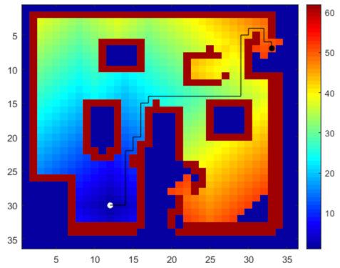
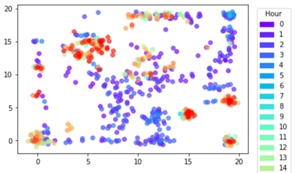
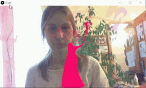
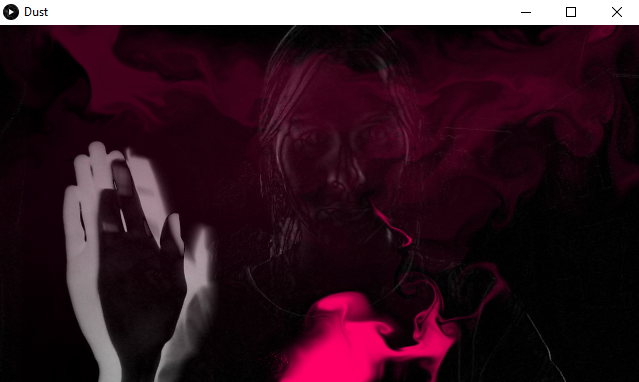
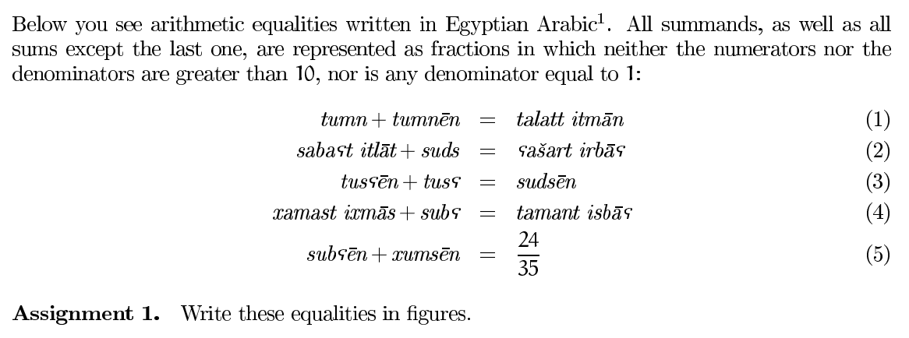

## Portfolio

---

[//]: # (### NLP projects)

[//]: # ()
[//]: # ([ **NLP project**]&#40;&#41;)

[//]: # ()
[//]: # (content)

[//]: # ()
[//]: # (---)

[ **Neural networks implementation in PyTorch \[WIP\]**]()

I am currently learning about NNs architecture in pure Python and PyTorch from the [great course made by Andrej Karpathy](). I have already covered backwards propagation of gradients, multi-layer perceptrons and attention blocks. I am planning to come up with an own architecture of NN at the end of this series. My **current progress** and my **solutions of exercises** [can be found here]().

---

[ **StyloMetrix**](https://github.com/azawadzka/StyloMetrix), [ Article](https://scholar.google.com/citations?user=Z8L_NU8AAAAJ)

**Q:** Why would you represent a text as a vector of linguistic features? **A:** To use them to compare classes of texts, or put them into explainable classification algorithms. Example usages: find the linguistic differences between genres of writing or identify medical condition from speech disfunction. 

A programme to create these vectors was my bachelor's thesis project. Later it was enthusiastically received at my job at NASK PIB and I kept working on the project as main developer. The link is my forked version of this repo. 

[//]: # ()

---

### Other

**ML algorithms implementations**

<a href="https://github.com/azawadzka/Wavefront-algorithm"> <b>Wavefront</b></a> greedy algorithm for finding shortest path 

<a href="https://github.com/azawadzka/Self-organizing-maps"> <b>Self-organinzing maps</b></a> clustering algorithm

---

[ **Graphics mini-projects**](https://github.com/azawadzka/ULPGC-CIU-Graphics)

I enjoy working with 3D graphics. I have animated things using **Processing** and **3ds Max**. I also like GIMP very much, for example, I made the header image for [this blog post](https://medium.com/towards-data-science/pandas-from-messy-to-beautiful-b03b0c32f767) using the Titanic dataset.

 

&#11014 Here I'm waving my hand to shoo away the smoke using frame diffs
  
&#11013 Here you can move around a dark museum room using mouse clicks. Later my friends and me built a <a href="https://github.com/azawadzka/ULPGC-CIU-3D-Game">game</a> on the top of this :) 

---

**Linguistics Olympiad**

This is high school content, but I think this is **so cool**. Try solving the puzzles below. This is from the [International Olympiad in Lingustics](https://ioling.org/problems/) and the Polish [Mathematical Linguistics Olympiad](https://fmw.math.uni.wroc.pl/dla-uczni%C3%B3w-lingwistyka-matematyczna-olimpiada-lingwistyczna/zadania/zadania-z-olimpiady-lingwistyki). I reached the **national finals** in the latter back in school and this has actually brought be to NLP (yay!).

 
<a href="https://ioling.org/problems/2003/i2/">IOL 2003, problem 2</a>

---

Page template forked from <a href="https://github.com/evanca/quick-portfolio">evanca</a>

<!-- Remove above link if you don't want to attibute -->
